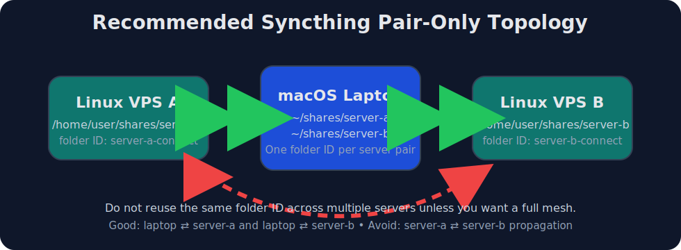

# Syncthing macOS ↔ Linux VPS sync guide

[](https://github.com/makash/syncthing-macos-linux-vps-sync)
[](LICENSE)


Practical guide and automation scripts for setting up **bidirectional Syncthing file sync between a macOS laptop and one or more Linux VPS servers over SSH** — with a safe **pair-only topology** that helps you avoid accidental full-mesh sync.

It supports both:

- **one pair per server**
- **multiple pairs per server user**

That second mode is useful when you SSH into a server as one admin or bootstrap user, but want separate synced folders owned by application users such as `appuser`, `deploy`, or `analyst`.



This repo is intentionally written so a coding agent can:

1. understand the desired topology,
2. make safe assumptions,
3. run a setup script with little or no human steering,
4. avoid accidental full-mesh sync.

## What this repo solves

If you have:

- one **macOS laptop**,
- one or more **Linux servers**,
- SSH access already configured,
- and you want files added on the laptop to appear on a server and vice versa,

this repo gives you:

- a clear how-to,
- a safe topology recommendation,
- a Linux bootstrap script,
- and a one-shot setup script you run from the Mac.

---

## Visual topology

The recommended setup is a **hub-and-pairs** model:

- `macOS laptop ⇄ Linux VPS A`
- `macOS laptop ⇄ Linux VPS B`
- **not** `Linux VPS A ⇄ Linux VPS B`

That gives you safe, isolated sync paths for each server.

## Recommended topology

### Pair-only sync

For most laptop + server workflows, the safest setup is **pair-only sync**:

- `laptop ⇄ server-a`
- `laptop ⇄ server-b`

This means each server syncs with the laptop, **but not with each other**.

### Why this matters

In Syncthing:

> **one folder ID = one sync cluster**

If you share the same Syncthing folder with multiple devices, changes can propagate across the whole cluster.

So if you do this:

- laptop shares folder `work-sync` with `server-a`
- laptop also shares the same folder `work-sync` with `server-b`

then:

- files from `server-a` can reach `server-b` via the laptop
- files from `server-b` can reach `server-a` via the laptop

That is a **3-way mesh**, even if the laptop feels like the “hub”.

### Correct pattern for pair-only sync

Use a **different folder ID and path per sync pair**.

Example with one user per server:

- `server-a-connect`
  - laptop: `~/shares/server-a`
  - server: `/home/user/shares/server-a`
- `server-b-connect`
  - laptop: `~/shares/server-b`
  - server: `/home/user/shares/server-b`

Example with multiple users on the same server:

- `server-a-appuser`
  - laptop: `~/shares/server-a/appuser`
  - server: `/home/appuser/shares/laptop`
- `server-a-deploy`
  - laptop: `~/shares/server-a/deploy`
  - server: `/home/deploy/shares/laptop`
- `server-b-deploy`
  - laptop: `~/shares/server-b/deploy`
  - server: `/home/deploy/shares/laptop`
- `server-b-analyst`
  - laptop: `~/shares/server-b/analyst`
  - server: `/home/analyst/shares/laptop`

This gives you:

- laptop ⇄ one specific server user
- isolation between users on the same server
- no server ⇄ server propagation
- no user-a ⇄ user-b propagation unless you explicitly create it

---

## Assumptions

This repo assumes:

- macOS laptop already has Syncthing installed
- Syncthing has been launched at least once on the Mac
- SSH config is already in place
- remote Linux login user can run `sudo -n` non-interactively
- remote server uses `systemd`
- Python 3 exists on the Mac and Linux server
- if you use `--remote-user`, the SSH login user has enough `sudo` access to configure Syncthing for that target user

The setup script supports common Linux package managers:

- `apt-get`
- `dnf`
- `pacman`
- `zypper`

Ubuntu/Debian is the main tested path.

---

## Files in this repo

- `scripts/install-syncthing-linux.sh`
  - installs and starts Syncthing on a Linux server
- `scripts/setup-mac-linux-pair.sh`
  - run from the Mac to create a laptop ⇄ server Syncthing pair

---

## Quick start

### 1. Install and launch Syncthing on the Mac

If you installed the macOS Syncthing app, launch it once so the config directory exists.

Common config location:

- `~/Library/Application Support/Syncthing`

### 2. Make sure your SSH alias works

Examples:

```bash
ssh server-a hostname
ssh server-b hostname
```

If you use a custom SSH config file:

```bash
ssh -F ~/.ssh/config server-a hostname
```

### 3. Create a simple pair for the first server

```bash
./scripts/setup-mac-linux-pair.sh \
  --ssh-config ~/.ssh/config \
  --ssh-host server-a \
  --folder-id server-a-connect \
  --label server-a-connect \
  --local-path ~/shares/server-a \
  --remote-path /home/user/shares/server-a
```

### 4. Create a pair for a specific user on a server

If you SSH in as one user but want the synced folder to belong to another user, pass `--remote-user`.

```bash
./scripts/setup-mac-linux-pair.sh \
  --ssh-config ~/.ssh/config \
  --ssh-host server-a \
  --remote-user deploy \
  --folder-id server-a-deploy \
  --label server-a/deploy \
  --local-path ~/shares/server-a/deploy
```

When `--remote-path` is omitted, the default remote path is:

```text
~<target-user>/shares/laptop
```

The target user is `--remote-user` when provided, otherwise the SSH login user.

So the example above syncs to:

```text
/home/deploy/shares/laptop
```

That’s it.

---

## What the setup script does

`scripts/setup-mac-linux-pair.sh` runs from the Mac and performs these steps:

1. detects the local Syncthing binary and config dir
2. checks SSH connectivity to the remote host
3. installs Syncthing on the Linux server if missing
4. decides which remote user should own the sync:
   - login user by default
   - or `--remote-user <user>` if provided
5. normalizes per-user Syncthing ports so multiple Linux users can run on the same host
6. starts Syncthing for that remote user:
   - existing SSH login user via `systemctl --user`
   - other users via `syncthing@<user>.service`
7. creates the local and remote sync folders
8. reads the device IDs for the Mac and the remote target user
9. adds each device to the other device list
10. creates a pair-only folder config on both sides
11. installs safe `.stignore` rules on both endpoints
12. refuses to continue if the requested folder already contains unexpected third-party devices

That last safety check is important: it prevents accidentally turning a pair into a mesh.

---

## Multi-user VPS tips

When you run Syncthing for multiple Linux users on the same server, each user is a separate Syncthing device with its own config, certificate, folders, and ports.

Practical rules:

- Use **one Syncthing instance per Linux user** when folder ownership matters.
- Use `syncthing@<user>.service` for users you are not logged in as.
- Give every `host + user` pair its own folder ID, label, and local path.
- Keep the server GUI bound to `127.0.0.1`; use SSH port forwarding if you need to inspect it.
- If discovery is slow or unreliable, add an explicit remote device address such as `tcp://server.example.com:22000` in Syncthing.

The setup script derives per-user ports from the Linux UID to avoid the usual multi-user conflicts:

- sync listen port: `22000 + (uid % 1000)`
- GUI port: `8384 + (uid % 1000)`
- local discovery port: `24000 + (uid % 1000)`

If those ports collide with an existing service on your server, adjust that user's Syncthing config before starting the service.

---

## Why use `.stignore`

For transfer folders, you usually want to sync actual content but skip OS/editor junk.

This repo writes the following safe defaults:

```gitignore
.DS_Store
._*
Thumbs.db
ehthumbs.db
*.swp
*.swo
*~
```

These ignore rules are installed on **each endpoint**, because `.stignore` is local Syncthing config, not a normal shared content file you should rely on propagating.

---

## How an agent should use this repo

If an agent is asked to “set up pair sync between my Mac and Linux server”, it should:

1. verify SSH works for the target alias
2. decide which **remote user** should own the sync
3. choose a **new folder ID** for that pair
4. choose a **dedicated local path** and **dedicated remote path**
5. run `scripts/setup-mac-linux-pair.sh`
6. verify the pair by creating a file on one side and checking it appears on the other
7. if there are multiple servers or users, repeat with a **different folder ID and path** per server/user pair

### Important agent rules

- Never reuse the same Syncthing folder ID for two different pairs unless full cross-propagation is desired.
- Treat **host + user** as the unit of isolation.
- Prefer folder IDs like `host-user` for multi-user setups.

---

## Verification checklist

After setup, verify:

### On the Mac

```bash
/Applications/Syncthing.app/Contents/Resources/syncthing/syncthing \
  cli --home "$HOME/Library/Application Support/Syncthing" \
  config folders list
```

### On the server

For the SSH login user:

```bash
ssh <alias> 'syncthing cli config folders list'
```

For a different synced user:

```bash
ssh <alias> 'sudo -n -u <user> env HOME=/home/<user> XDG_CONFIG_HOME=/home/<user>/.config syncthing cli --home /home/<user>/.config/syncthing config folders list'
```

### End-to-end test

Create a file on the Mac:

```bash
echo "hello from mac" > ~/shares/server-a/appuser/test-from-mac.txt
```

Check on the server:

```bash
ssh server-a 'sudo -n -u appuser ls -la /home/appuser/shares/laptop/test-from-mac.txt'
```

Then do the reverse:

```bash
ssh server-a 'sudo -n -u appuser sh -c "echo hello-from-server > /home/appuser/shares/laptop/test-from-server.txt"'
ls -la ~/shares/server-a/appuser/test-from-server.txt
```

---

## Troubleshooting

### 1. Port-forward conflicts from SSH config

If your SSH config defines `LocalForward` entries, they can interfere with automation.

This repo’s setup script uses:

- `-o ClearAllForwardings=yes`
- `-o ControlMaster=no`
- `-o ControlPath=none`

to avoid inherited SSH multiplexing and forwarding surprises.

### 2. Syncthing installed but not connecting

Check:

- for the SSH login user, the user service is running:

```bash
ssh <alias> 'systemctl --user status syncthing.service --no-pager'
```

- for another synced user, the system instance is running:

```bash
ssh <alias> 'sudo systemctl status syncthing@<user>.service --no-pager'
```

- linger is enabled when using the login user's user service:

```bash
ssh <alias> 'loginctl show-user "$USER" -p Linger'
```

### 3. Folder unexpectedly syncs across multiple servers

You likely reused the same folder ID in more than one pair.

Fix by:

- creating a new folder ID per pair
- using separate local paths
- using separate remote paths

### 4. macOS app path differs

The scripts try to use:

- `/Applications/Syncthing.app/Contents/Resources/syncthing/syncthing`

If you installed Syncthing another way, ensure `syncthing` is on `PATH` or adapt the script.

---

## Security notes

- Syncthing traffic is end-to-end authenticated and encrypted between devices.
- SSH is only used here for bootstrap and configuration automation.
- Avoid exposing the Syncthing GUI publicly; keep it bound to localhost on servers.

---

## Suggested repo usage patterns

### One laptop + one server

Use one pair:

- folder ID: `server-connect`
- laptop path: `~/shares/server`
- remote path: `/home/user/shares/server`

### One laptop + many servers

Use one pair per server:

- `server-a-connect` → `~/shares/server-a`
- `server-b-connect` → `~/shares/server-b`
- `server-c-connect` → `~/shares/server-c`

This preserves isolation.

### One laptop + many server users

Use one pair per `host/user` combination:

- `server-a-appuser` → `~/shares/server-a/appuser`
- `server-a-deploy` → `~/shares/server-a/deploy`
- `server-b-deploy` → `~/shares/server-b/deploy`
- `server-b-analyst` → `~/shares/server-b/analyst`

Default remote paths with `--remote-user`:

- `server-a / appuser` → `/home/appuser/shares/laptop`
- `server-a / deploy` → `/home/deploy/shares/laptop`
- `server-b / deploy` → `/home/deploy/shares/laptop`
- `server-b / analyst` → `/home/analyst/shares/laptop`

---

## Example: exact commands for a multi-user setup

```bash
./scripts/setup-mac-linux-pair.sh \
  --ssh-config ~/.ssh/config \
  --ssh-host server-a \
  --remote-user appuser \
  --folder-id server-a-appuser \
  --label server-a/appuser \
  --local-path ~/shares/server-a/appuser

./scripts/setup-mac-linux-pair.sh \
  --ssh-config ~/.ssh/config \
  --ssh-host server-a \
  --remote-user deploy \
  --folder-id server-a-deploy \
  --label server-a/deploy \
  --local-path ~/shares/server-a/deploy

./scripts/setup-mac-linux-pair.sh \
  --ssh-config ~/.ssh/config \
  --ssh-host server-b \
  --remote-user deploy \
  --folder-id server-b-deploy \
  --label server-b/deploy \
  --local-path ~/shares/server-b/deploy

./scripts/setup-mac-linux-pair.sh \
  --ssh-config ~/.ssh/config \
  --ssh-host server-b \
  --remote-user analyst \
  --folder-id server-b-analyst \
  --label server-b/analyst \
  --local-path ~/shares/server-b/analyst
```

---

## If you want a full mesh instead

If you explicitly want all devices to receive everything, then you can reuse the same folder ID on all of them.

Just do that intentionally.

For most laptop + VPS workflows, pair-only sync is the safer default.

---

## License

This project is licensed under the [MIT License](LICENSE).
